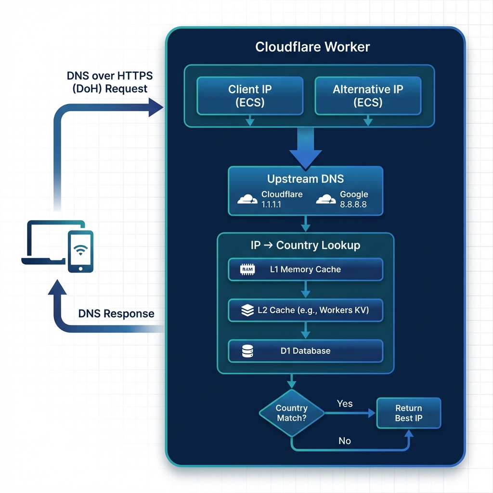

# 国家感知的 DNS over HTTPS (DoH) Worker

一个 Cloudflare Worker，通过智能处理 EDNS 客户端子网 (ECS) 来优化 CDN 路由。它使用客户端的实际 IP 和备用 IP（例如 VPN 出口 IP）双重解析 DNS 查询，以选择最佳响应，确保最优性能和内容可用性。

[English Documentation](README_EN.md)



## 功能特性

- **智能路由**: 通过检查解析的 IP 是否与客户端所在国家匹配，优先选择本地 CDN 节点。
- **VPN 优化**: 如果本地查询未能匹配国家，则回退到备用 IP 解析，确保通过 VPN 访问。
- **隐私优先**: 通过 HTTPS 加密 DNS 查询，防止窃听。
- **D1 数据库**: 使用 Cloudflare D1 进行高效的地理位置查询。
- **IPv6 支持**: 完整支持 AAAA 记录解析和 IPv6 地理定位。
- **多级缓存**: L1（内存）+ L2（缓存 API）实现超低延迟。
- **上游故障转移**: DNS 上游之间自动故障转移（Cloudflare → Google）。

## 数据源

本项目使用 **[Loyalsoldier/geoip](https://github.com/Loyalsoldier/geoip)** 作为 IP 地理定位数据。无需注册或 API 密钥！

## 前置要求

部署前，请确保你拥有：

- 一个 [Cloudflare](https://dash.cloudflare.com/sign-up) 账户。
- 一个 GitHub 账户。

## 部署

本项目使用 **GitHub Actions** 进行自动化部署和初始化。你无需在本地安装任何工具。

### 1. Fork 仓库

将此仓库 Fork 到你自己的 GitHub 账户。

### 2. 配置 Secrets

进入你 Fork 的仓库的 **Settings** > **Secrets and variables** > **Actions**，添加以下 **Repository secrets**：

| Secret 名称             | 说明                                                                                    |
| :---------------------- | :-------------------------------------------------------------------------------------- |
| `CLOUDFLARE_API_TOKEN`  | 你的 Cloudflare API Token。[在此获取](https://dash.cloudflare.com/profile/api-tokens)。 |
| `CLOUDFLARE_ACCOUNT_ID` | 你的 Cloudflare Account ID。可在 Cloudflare 控制面板的 URL 中找到。                     |
| `UPSTREAM_ENDPOINT`     | （可选）自定义主上游 DoH 服务器（默认：`https://1.1.1.1/dns-query`）。                  |

> **CLOUDFLARE_API_TOKEN 必需权限 (Custom Token)**:
>
> 1. `Account` > `Worker Scripts` > `Edit`
> 2. `Account` > `D1` > `Edit`

### 3. 部署

部署工作流自动运行：

1. **启用工作流**: 进入仓库的 **Actions** 标签页，如有提示请启用工作流。
2. **触发部署**: 工作流在每次推送到 `main` 分支时自动运行，也会在每周二 10:30 UTC 定时运行。你也可以从 **Actions** 标签页手动触发，选择 "Deploy" 工作流并点击 **Run workflow**。

> **自动设置**: 工作流将自动从 Loyalsoldier 下载 GeoIP 数据库，创建 D1 数据库，导入数据（IPv4 和 IPv6），并部署 Worker。

## 配置

Worker 主要通过上述定义的 **GitHub Secrets** 进行配置。

### 可选环境变量

这些变量可以在 `wrangler.toml` 或 Cloudflare 控制面板中设置，以自定义 Worker 行为：

| 变量                 | 默认值              | 说明                                |
| :------------------- | :------------------ | :---------------------------------- |
| `MEM_CACHE_MAX_SIZE` | `10000`             | GeoIP 内存缓存的最大条目数          |
| `CACHE_TTL_SECONDS`  | `86400`             | GeoIP 缓存 TTL，单位为秒（24 小时） |
| `DEBUG`              | `false`             | 启用详细日志（设置为 `true` 启用）  |
| `COUNTRY_PRIORITY`   | `CN,HK,TW,JP,SG,US` | 路由的国家优先级，逗号分隔          |

**wrangler.toml 示例:**

```toml
[vars]
MEM_CACHE_MAX_SIZE = "20000"
CACHE_TTL_SECONDS = "43200"
DEBUG = "true"
COUNTRY_PRIORITY = "CN,HK,TW,JP,SG,US"
```

## API 端点

### DoH 端点 (RFC 8484)

`GET/POST https://<your-worker-domain>/?dns=<BASE64_DNS_QUERY>`

### JSON DNS API

```bash
GET https://<your-worker-domain>/resolve?name=example.com&type=A
```

返回兼容 Google DNS JSON API 的响应。

### 健康检查

```bash
GET https://<your-worker-domain>/health
```

### 统计信息

```bash
GET https://<your-worker-domain>/stats
```

### IP 调试

```bash
GET https://<your-worker-domain>/debug/ip/8.8.8.8
```

## API 参考

DoH 端点接受以下格式的请求：

`https://<your-worker-domain>/client-ip/<IP>/client-country/<COUNTRY_CODE>/alternative-ip/<ALT_IP>/dns-query`

### 参数

| 参数             | 说明                                      | 必需 | 来源优先级                           |
| :--------------- | :---------------------------------------- | :--- | :----------------------------------- |
| `client-ip`      | 客户端的真实 IP 地址。                    | 否   | URL 路径 > `CF-Connecting-IP` 请求头 |
| `client-country` | 客户端的 2 字母 ISO 国家代码。            | 否   | URL 路径 > `CF-IPCountry` 请求头     |
| `alternative-ip` | 用于二次解析的 IP 地址（例如 VPN 出口）。 | 是   | URL 路径                             |

### 示例

```bash
curl "https://doh.subdomain.workers.dev/client-ip/223.5.5.5/client-country/CN/alternative-ip/8.8.8.8/dns-query?dns=<BASE64_DNS_QUERY>"
```

## 贡献

欢迎贡献！请随时提交 issue 或 pull request。
