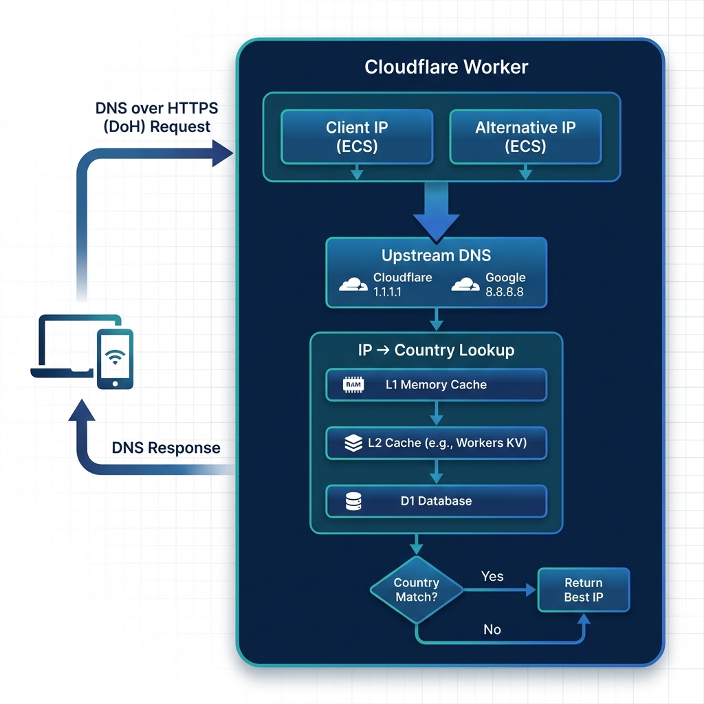

# Country-Aware DNS over HTTPS (DoH) Worker

A Cloudflare Worker that optimizes CDN routing by intelligently handling EDNS Client Subnet (ECS). It dual-resolves DNS queries using both the client's actual IP and an alternative IP (e.g., VPN exit IP) to select the best response, ensuring optimal performance and content availability.

[中文文档](README.md) · [Operations Runbook](RUNBOOK.md)



## Features

- **Smart Routing**: Prioritizes local CDN nodes by checking if the resolved IP matches the client's country.
- **VPN Optimization**: Falls back to an alternative IP resolution if the local lookup fails to match the country, ensuring access through VPNs.
- **Privacy First**: Encrypts DNS queries via HTTPS, protecting against eavesdropping.
- **D1 Database**: Uses Cloudflare D1 for efficient Geolocation lookups.
- **IPv6 Support**: Full support for AAAA record parsing and IPv6 geolocation.
- **Multi-Level Caching**: L1 (Memory) + L2 (Cache API) for ultra-low latency.
- **Upstream Failover**: Automatic fallback between DNS upstreams (Cloudflare → Google).

## Data Source

This project uses **[Loyalsoldier/geoip](https://github.com/Loyalsoldier/geoip)** for IP geolocation data. No registration or API keys are required!

## Prerequisites

Before deploying, ensure you have:

- A [Cloudflare](https://dash.cloudflare.com/sign-up) account.
- A GitHub account.

## Deployment

This project uses **GitHub Actions** for automated deployment and initialization. You do not need to install any tools locally.

### 1. Fork the Repository

Fork this repository to your own GitHub account.

### 2. Configure Secrets

Go to your forked repository's **Settings** > **Secrets and variables** > **Actions**, and add the following **Repository secrets**:

| Secret Name             | Description                                                                               |
| :---------------------- | :---------------------------------------------------------------------------------------- |
| `CLOUDFLARE_API_TOKEN`  | Your Cloudflare API Token. [Get it here](https://dash.cloudflare.com/profile/api-tokens). |
| `CLOUDFLARE_ACCOUNT_ID` | Your Cloudflare Account ID. Found in the URL of your Cloudflare Dashboard.                |
| `HEALTHCHECK_PING_URL`  | (Optional) healthchecks.io dead-man-switch Ping URL; the heartbeat step silently skips when unset. |

> **CLOUDFLARE_API_TOKEN Required Permissions (Custom Token)**:
>
> 1. `Account` > `Worker Scripts` > `Edit`
> 2. `Account` > `D1` > `Edit`

### 3. Deploy

The deployment workflows:

1. **Enable Workflows**: Go to the **Actions** tab in your repository and enable workflows if asked.
2. **Deploy the Worker**: Manually trigger "Deploy to Cloudflare Workers" from the **Actions** tab (mode: `worker-only`).
3. **GeoIP Data**: Maintained automatically by the "GeoIP Daily Sync" workflow (daily at 10:45 UTC) — the first run creates `geoip_live_weur` and trickles the data in via quota-sized chunks (~7 days), then keeps it converged to the latest Loyalsoldier release with gated deltas (zero writes when nothing changed). See [RUNBOOK.md](RUNBOOK.md).

## Configuration

The worker is configured primarily through the **GitHub Secrets** defined above.

### Optional Environment Variables

These variables can be set in `wrangler.toml` or Cloudflare Dashboard to customize worker behavior:

| Variable             | Default             | Description                                  |
| :------------------- | :------------------ | :------------------------------------------- |
| `MEM_CACHE_MAX_SIZE` | `10000`             | Maximum entries in GeoIP memory cache        |
| `CACHE_TTL_SECONDS`  | `86400`             | GeoIP cache TTL in seconds (24 hours)        |
| `DEBUG`              | `false`             | Enable verbose logging (`true` to enable)    |
| `DEBUG_TOKEN`        | (unset)             | Access token for `/debug/ip/`; when unset the endpoint always returns 404 (closed by default) |
| `COUNTRY_PRIORITY`   | `CN,HK,TW,JP,SG,US` | Comma-separated country priority for routing |

**Example wrangler.toml:**

```toml
[vars]
MEM_CACHE_MAX_SIZE = "20000"
CACHE_TTL_SECONDS = "43200"
DEBUG = "true"
COUNTRY_PRIORITY = "CN,HK,TW,JP,SG,US"
```

## API Endpoints

### DoH Endpoint (RFC 8484)

`GET/POST https://<your-worker-domain>/?dns=<BASE64_DNS_QUERY>`

### JSON DNS API

```bash
GET https://<your-worker-domain>/resolve?name=example.com&type=A
```

Returns Google DNS JSON API compatible response.

### Health Check

```bash
GET https://<your-worker-domain>/health
```

### Statistics

```bash
GET https://<your-worker-domain>/stats
```

### IP Debug (token required)

```bash
# Requires the DEBUG_TOKEN secret on the Worker (Dashboard → Workers & Pages →
# doh → Settings → Variables and Secrets, or `wrangler secret put DEBUG_TOKEN`).
# Without a configured token this endpoint always returns 404 (it would
# otherwise be an unauthenticated geo-oracle burning the D1 read quota).
curl -H "x-debug-token: <your-token>" "https://<your-worker-domain>/debug/ip/8.8.8.8"
```

## API Reference

The DoH endpoint accepts requests in the following format:

`https://<your-worker-domain>/client-ip/<IP>/client-country/<COUNTRY_CODE>/alternative-ip/<ALT_IP>/dns-query`

### Parameters

| Parameter        | Description                                                          | Required | Source Priority                      |
| :--------------- | :------------------------------------------------------------------- | :------- | :----------------------------------- |
| `client-ip`      | The client's real IP address.                                        | No       | URL Path > `CF-Connecting-IP` header |
| `client-country` | The 2-letter ISO country code of the client.                         | No       | URL Path > `CF-IPCountry` header     |
| `alternative-ip` | The IP address to use for the secondary resolution (e.g., VPN exit). | Yes      | URL Path                             |

### Example

```bash
curl "https://doh.subdomain.workers.dev/client-ip/223.5.5.5/client-country/CN/alternative-ip/8.8.8.8/dns-query?dns=<BASE64_DNS_QUERY>"
```

## Contributing

Contributions are welcome! Please feel free to open issues or submit pull requests.
